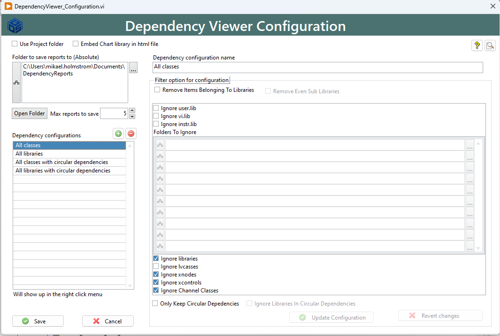

# DependecyViewer
Dependency Analysis and viewer of LV Code

With this toolkit you can easily inspect items in your project for circular dependecies by right clicking on an Item and selecting what your want to inspect

You can even create a configuration to inspect the whole project

