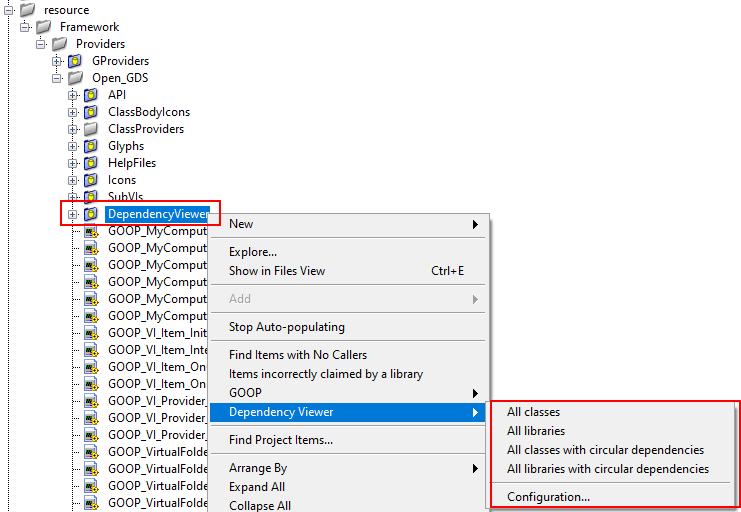
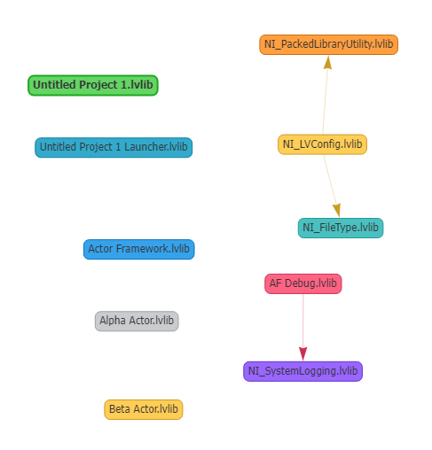

# DependecyViewer
Dependency Analysis and viewer of LV Code

With this toolkit you can easily inspect items in your project for circular dependecies by right clicking on an Item you want to inspect and selecting the configuration you want to analyse with.

After selecting you favourite configuration you can view all the dependecies, like the ones in the actor framework.

You can even change existing or create a new configurations to use to inspect your project items with.

